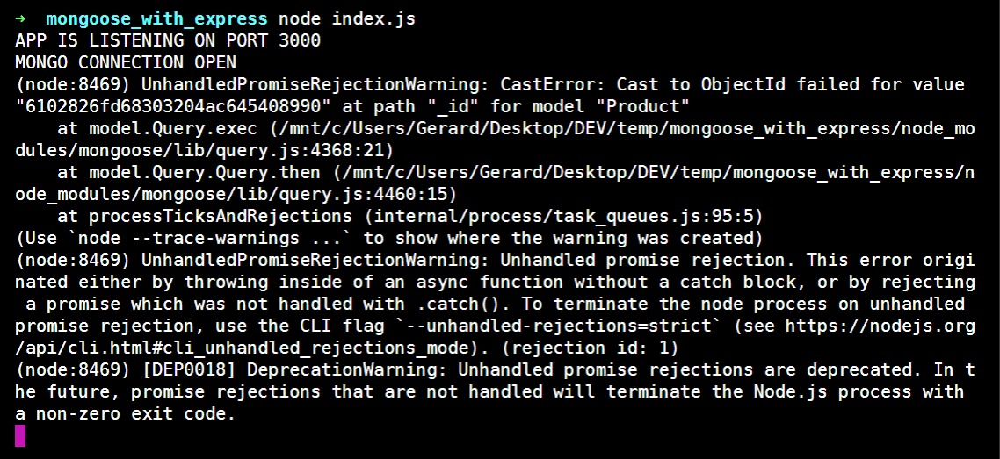
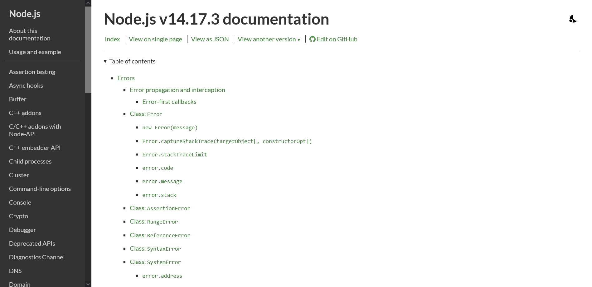
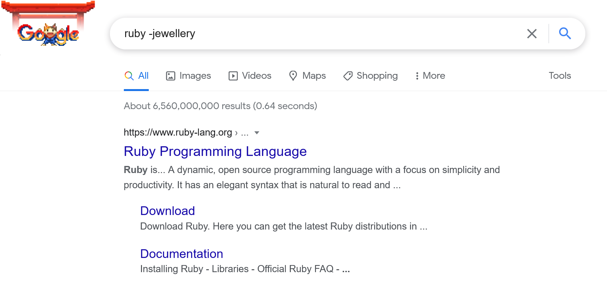
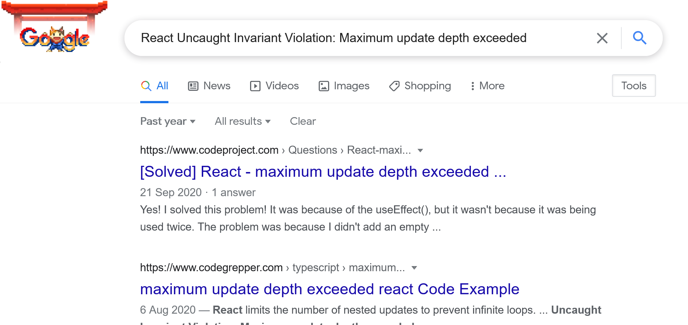
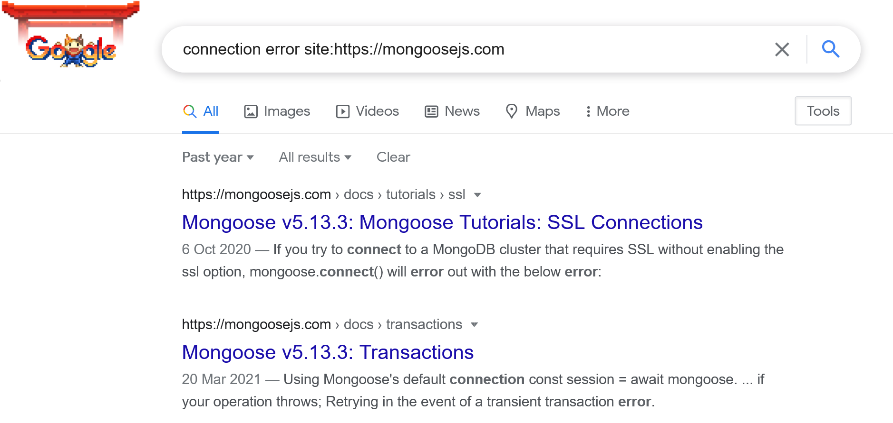
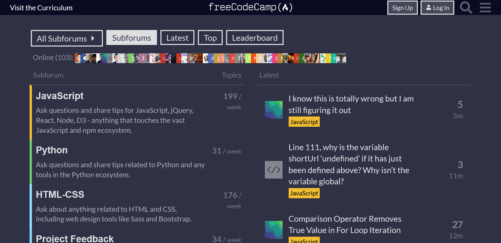
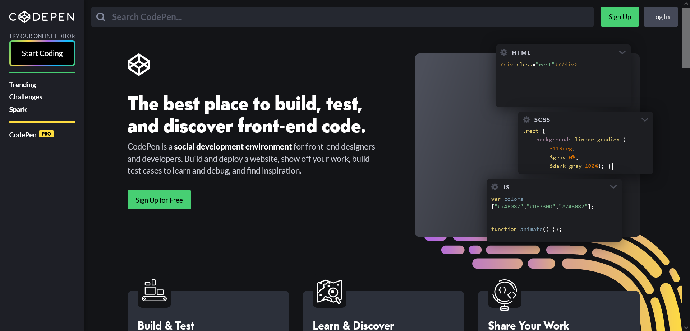

You know the feeling, right? You're following a programming tutorial, pouring new knowledge and skills into your head. Life is good. And then, suddenly, it's not.

Something breaks. Your screen is covered in a less-than-helpful error message, your terminal is printing warnings about things you've never heard of, your code has fallen over in a heap.

Even with the most well-paced and clear tutorials, you will get stuck. I still do, all the time.

It's frustrating, but it's not the end of the world. It might not feel like it, but it can be a great opportunity to learn.

With experience, I've gotten better at getting unstuck, and I'd like to share a few methods I've collected for pushing through these challenges and getting back on track.

### Read, Search, Ask

I've learned debugging tips from a wide range of sources but the foundation of my process for getting unstuck comes from freeCodeCamp's [Read, Search, Ask methodology](https://forum.freecodecamp.org/t/how-to-get-help-when-you-are-stuck-coding/19514).

When you get stuck, their advice is to:

- Read the documentation or error
- Search Google
- Ask your friends for help

This is a good strategy for three reasons:

1. It will minimize the amount of time you spend stuck,
2. It will maximize your chance of learning from the problem,
3. It will help you to be respectful of other people's time when you ask them for help.

This is still the core of my process for getting unstuck but I want to expand on what exactly I do when I **Read**, **Search** and **Ask**.

### 1. Read

#### Read the Error Message



Is there an error message yelling at you? Great! It might not seem it, but error messages are there to help you. It would be worse if your code just failed silently and left you none the wiser.

Yes, sometimes error messages will be totally unhelpful, giving you no more information than "something went wrong". But other times the error message will point you on your way. If you see `TypeError: Cannot read property ‘length’ of undefined`, check the variable that's showing up as undefined.

Look at the filename and line number and see what's going on there. But, bear in mind, where your code crashed is where the error happened, not necessarily where the problem was first introduced. Maybe the error happened in your `getUsers()` function, but the problem started in a `checkAuthentication()` function that then called `getUsers()`. Follow the call stack and see how far you can get.

If the error message contains things you don't understand, don't panic, that's when you turn to Google (more on this below).

#### Read Your Code

Sometimes it feels like 90% of bugs are caused by one character being wrong; a typo in a variable or function name, a missing closing parentheses or bracket. Look for these. Extensions like [Bracket Pair Colorizer](https://marketplace.visualstudio.com/items?itemName=CoenraadS.bracket-pair-colorizer) can make this easier to spot.

If the code you can see looks ok, try to surface the values that aren't immediately visible. Maybe a value is updating in the UI but isn't getting saved to the database. Drop a `console.log()` into both your frontend and backend code. If the value changed, or failed to change, at some point, work backwards and try to find where the disconnect happened.

#### Read the Instructor's Code

It's always helpful when an instructor provides a GitHub repo or includes downloadable files. If you have this, open it up and start comparing your code and theirs.

Download their code and open it in your editor. Sometimes seeing their code with the same syntax highlighting as yours can help to make the differences stand out. [Diffchecker](https://www.diffchecker.com/) is also useful when you're comparing two versions of the same code line by line.

Narrow down the amount of code you need to read. Comment out all the code you just wrote. Uncomment it step by step and see when it breaks again. If you're working with components, comment out every component and gradually reintroduce them. Maybe it was the `Header` rather than the `RegistrationForm` that was causing the problem.

#### Read the Documentation



When you're learning a technology for the first time, going from a tutorial to the docs can feel like diving into the deep end. Not all docs are well written or organized. Not all docs have good search functionality. But this is where a lot of your learning will happen.

Reading the docs forces you to try to understand the technology you're using rather than just passively copying the tutorial. This is harder but also much more beneficial.

The docs are a lifesaver when the syntax or the API has changed since the tutorial was created. You could have banged your head on the keyboard for hours but it turns out that you just need to change `if (process.browser)` to `if (typeof window !== "undefined")`.

Check which version of a library or framework the tutorial was using. If version 3.0 has replaced version 2.0, look for a **migration guide** to help you get your code up to date. Now you'll not just have a working project again, but you'll have a better understanding of the underlying tools and technologies.

### 2. Search


Ok, you've read your code, the instructor's code and the docs. Time to turn to Google.

Thankfully, you are almost certainly not the first person to run into this specific problem. If a technology has existed long enough for there to be tutorials, then other people have already run into problems with it and written questions and answers that you can find.

Don't feel guilty about googling. Every developer does it, from newbies to veterans.

Colt Steele has a great video on [The Google History of a High-Paid Senior Engineer](https://www.youtube.com/watch?v=LW9pT246LrI) which shows how often skilled and knowledgeable engineers google even basic concepts.

Googling is a skill that you will develop with time and practice. There's a useful post from Juan Cruz Martinez on [how to get better at googling as a developer](https://betterprogramming.pub/11-tricks-to-master-the-art-of-googling-as-a-software-developer-2e00b7568b7d).

Here, I'll focus on four ways to search more effectively:

1. Be as specific as possible
2. Include the error messages
3. Limit it to the last year or two
4. Search within specific sites

#### Be as specific as possible



You're following a tutorial on a specific technology. Put that at the start of your search. If you're using just JavaScript, start your search with "JavaScript". If you're using React or Vue, start with them. If you're using Next or Nuxt, put them as your first keyword. Be specific.

One pattern I've seen is to structure your search like this: `LANGUAGE/FRAMEWORK VERB KEYWORDS`. This seems to provide better autocomplete suggestions from Google.

If you're having an issue with a font not loading in a Gatsby site that uses styled-components, search for something like `styled-components Gatsby load fonts`.

If you're getting irrelevant results, you can use `-` to remove unwanted terms from your search: `KEYWORD -UNWANTED_WORD`.

For example, if you're stuck on a Ruby tutorial, include `-jewellery`, or `-jewelry` if you prefer, in your search to filter out results about the precious stone rather than the programming language.

#### Include the error message



If you got an error message and it wasn't enough to tell you what was wrong with your code, it might still prove useful in helping you find a resource that can help you.

Now, error messages will often include a lot of information that is specific to your application or your machine. Remove this or it might prevent you from finding similar results. Don't copy the entire error message with the stack trace.

James Roe offerd [this advice](https://twitter.com/james_roe/status/948706229785739264):

> error code -> error message -> language -> library -> syntax would be my general guide, in descending order of usefulness with other keywords.

I would recommend including the library/framework you are working with. For example, Node.js is used in a lot of build tools and you might get similar looking error messages even though you're using different technologies on top of Node. Search for `Nextjs ERROR_MESSAGE` rather than just `ERROR_MESSAGE`.

Say you get this error message from a React app:

```
Uncaught Invariant Violation: Maximum update depth exceeded. This can happen when a component repeatedly calls setState inside componentWillUpdate or componentDidUpdate. React limits the number of nested updates to prevent infinite loops.
```

I would search for `React Uncaught Invariant Violation: Maximum update depth exceeded.` The rest of the error message and the stack trace is React helping you to debug your code but it's too much detail to make for a good Google search.

#### Limit it to the last year or two

Programming resources go out of date fast and material from a couple of years ago might no longer be helpful to you. Using `:before` and `:after` in your search will limit the results to before of after a specific date: `KEYWORD after:DATE`

I usually limit my searches to the last two years and sometimes just to the last month to check if some recent change to the library of framework may be causing the issue.

#### Search within specific sites



You can use Google to search within a specific site even if that site doesn't have a built-in search feature: `KEYWORD site:WEBSITE_URL`. This can be handy if you're trying to search through documentation.

If the tutorial is on a site with comments (such as YouTube, Medium or Dev.to), look there. Several times I've crossed my fingers and scrolled down, hoping someone else had already run into the same issue and gotten an answer.

If the learning resource you're using has a forum, Slack or Discord, search them. Include the section or video title in your search terms. These will also be great places to ask questions (more below).

I've found GitHub issues to be particularly useful when I run into problems with libraries and frameworks. If you're experiencing a problem with React, Angular or Vue, someone else likely has too. That said, when you find your exact problem in an open GitHub issue, with no sign of being resolved, it can be a bit demoralizing, so your mileage may vary.

### 3. Ask



Asking for help can be intimidating. You're exposing yourself to the scrutiny of others. Maybe you're worried about wasting someone else's time or worried about looking foolish if the solution turns out to be "obvious" in hindsight. Imposter syndrome can rear its head here.

If you're intimidated to post a question online, try [Rubber Duck Debugging](https://en.wikipedia.org/wiki/Rubber_duck_debugging) first. Explain your code line by line out loud to your cat, a desk lamp or the ceiling. Sometimes, explaining a problem can jolt your brain into offering a solution.

Remember, if you've made a genuine effort to understand a problem before asking for help, you have no reason to feel embarassed or guilty.

Some sites - I'm thinking of Stack Overflow and Reddit - can be hostile, but there are others that are much friendlier for learners.

If you're looking for a safe place to ask questions, head to the places where other learners are.

Learning resources often have a forum - [freeCodeCamp](https://www.freecodecamp.org/), [Treehouse](https://teamtreehouse.com/), and [Codecademy](https://www.codecademy.com/#) all do - and I can speak from experience that there are plenty of people there who are happy to help you get unstuck with those courses.

If you're following a tutorial on YouTube, Dev.to or Medium, post your question in the comments. If the instructor doesn't get back to you, one of the other learners might.

I have to admit, I'm often reluctant to ask questions online. I don't want to look inept or to annoy anyone. So when I do ask questions, I try to do the following:

1. Include specific details
2. Share what you've tried
3. Make your code available

#### Include specific details

Don't write "My app's not working. Help!". Try something more like "I've gotten to the part of the tutorial where we add the ability to update todos. I can mark a todo as completed in the app interface but when I reload the page it shows it as not completed. I've looked at the React developer tools and the state is updating so I think the problem is that the data's not getting saved to the database. It might be an issue with my updateTodo function. Has anyone else run into this?"

I try to follow the pattern:

- Here's what's meant to be happening.
- Here's what's going wrong.
- Here's what I've tried to fix it.

#### Share what you've tried

Sharing the steps you've tried is important for two reasons:

1. It shows that you're not wasting people's time by asking for help without having done any work yourself
2. It gives other people an idea of what you've already ruled out

People will be much more likely to pitch in and help you if you show that you've given the problem your best and aren't expecting them to solve it for you.

Sharing your steps will also help them to get up to speed with your code and save them from having to ask you several basic questions.

#### Make your code available



It will be much easier for someone to help you if they can see your code for themselves.

By all means focus on the part of the code where you think the problem is, but also give them a link to the full project so they can read your code in context.

There are so many services that let you share your code for free. Provide a link to a [Codepen](https://codepen.io/), [repl](https://replit.com/), [CodeSandbox](https://codesandbox.io/), or [GitHub](https://github.com/) repo so they can view it for themselves.

If you're having issues with a build on Netlify or Vercel, give them the full error message and stack trace as well as a link to your project.

It can also be really helpful to include clear screenshots of the problem, whether that's the error message or the weird layout problem you're encountering.

The more context you can provide, the easier it will be for someone else to understand your code and offer help.

### Getting Stuck is Normal, and Can Be Beneficial

Being frustrated is a natural part of programming and of learning any topic. If you never run into an issue, how do you know you're not just copying code without actually learning? It might be more enjoyable to follow a tutorial and have everything work first time, but you will learn the topic much more effectively and thoroughly if you are forced to think about what you are doing. Have a look at the theory of [deliberate practice](https://jamesclear.com/beginners-guide-deliberate-practice) to find out more about this.

When you get stuck, it's ok to get frustrated, but don't stay frustrated. Take a break, go for a walk and clear your head.

When you come back, work the problem. Remember that you have the skills and resources to get yourself unstuck. And remember, too, there are a lot of people who are more than happy to help you if you put the work in first.

I hope this post was helpful. Best of luck with the next topic you're learning.

### More Resources

- [Amy Haddad, How to Get Unstuck When You Hit a Programming Wall, freeCodeCamp](https://www.freecodecamp.org/news/how-to-get-unstuck/)

- [Ben Awad, How to Google Search Error Messages, YouTube](https://www.youtube.com/watch?v=1OX-mns8UJw&t=64s)

- [Beth Qiang, Read, Search, (Don’t Be Afraid to) Ask, freeCodeCamp](https://www.freecodecamp.org/news/read-search-dont-be-afraid-to-ask-743a23c411b4/)

- [Bolaji Ayodeji, How to Ask Effective Questions: A Practical Guide for Developers, freeCodeCamp](https://www.freecodecamp.org/news/asking-effective-questions-a-practical-guide-for-developers/)

- [Colt Steele, The Google History of a High-Paid Sr. Engineer, YouTube](https://www.youtube.com/watch?v=LW9pT246LrI)

- [Juan Cruz Martinez, 11 Tricks To Master the Art of Googling as a Software Developer, BetterProgramming](https://betterprogramming.pub/11-tricks-to-master-the-art-of-googling-as-a-software-developer-2e00b7568b7d)

- [Swyx, How To Google Your Errors, Dev.to](https://dev.to/swyx/how-to-google-your-errors-2l6o)
