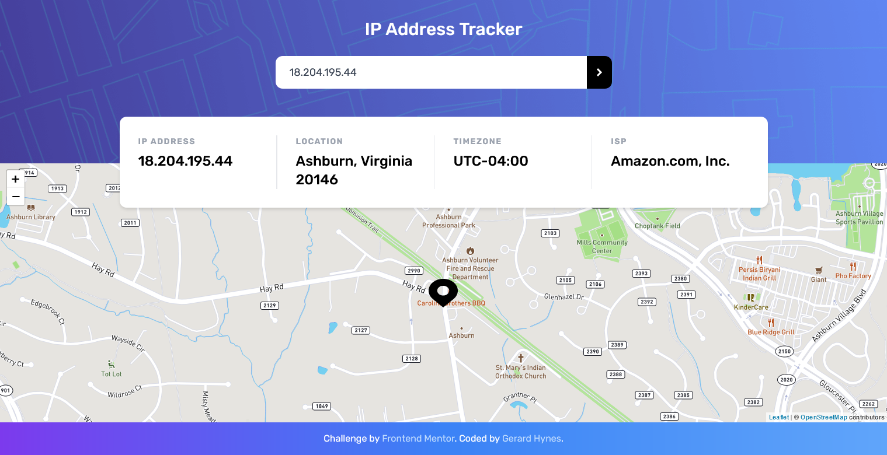
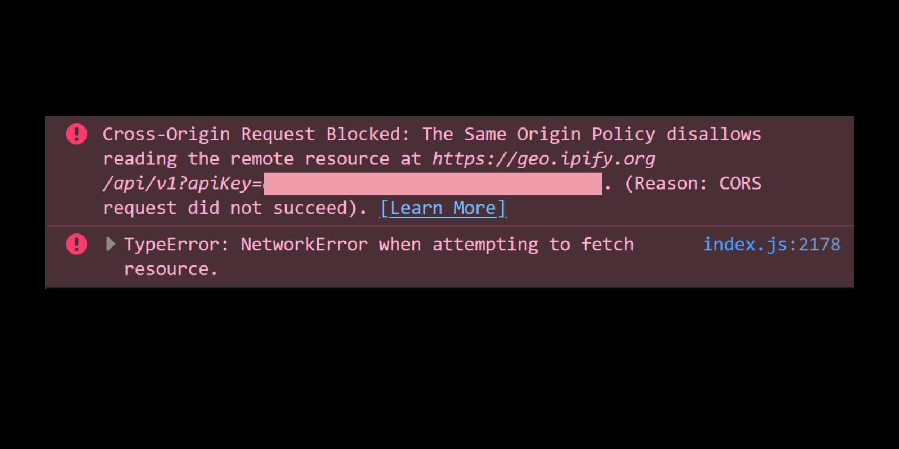
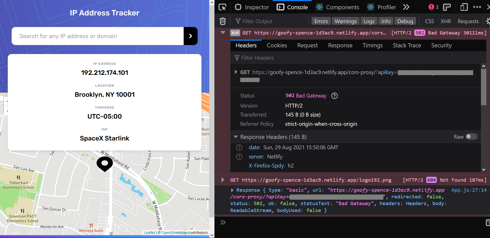

### The Problem

Recently I was working on a [Frontend Mentor challenge](https://www.frontendmentor.io/challenges/ip-address-tracker-I8-0yYAH0), an app where you can input an IP address or url and fetch and display information about it.



Things were going well. I got the layout sorted, I set up a custom map using React Leaflet and Mapbox.

When it was time to fetch the data from the API, however, I ran into problems.

Frontend Mentor had suggested using the [IP Geolocation API by IPify](https://geo.ipify.org/) to get information based off an IP address or domain.

If you sign up for a free account with IPify and paste `https://geo.ipify.org/api/v1?apiKey=YOUR_API_KEY` into your url bar, it'll send back JSON with information about your IP address, your location, and your ISP provider.

But if you try to make a HTTP request to this API from your client-side code, you'll get a message about CORS.



### What is CORS?

[CORS (Cross Origin Resource Sharing)](https://developer.mozilla.org/en-US/docs/Web/HTTP/CORS) is a mechanism that uses HTTP headers to give a browser permission to access resources from a server that's different from the server of the website making the request.

It exists for a very good reason: **security**. You don't want some random website to be able to ping your server and get sensitive data from it. To prevent this, browsers restrict cross-origin HTTP requests initiated from client-side scripts by default.

You need to specify which urls can access data from your server by making sure the correct CORS headers get sent with each request. But you can't just change the CORS settings on someone else's server because that would defeat the whole point of CORS as a security layer.

### CORS Proxies

The solution that most resources recommended is to use a proxy, another server that will receive the request from your browser, pass it on to the server you're trying to access, and then pass that server's response back to you. This way the entire request response process occurs server-side and isn't subject to CORS.

There are a number of CORS proxies you can use, such as [crossorigin.me](https://corsproxy.github.io/) or [CORS Anywhere](https://cors-anywhere.herokuapp.com/corsdemo).

But I didn't want to rely on a third-party proxy. After all, they can see all the data that you pass to them and could stop working at any time. I also didn't want to run and manage my own Node app just to act as a proxy.

While doing some research, I came across a blog post by Jim Nielsen about [setting up a CORS proxy with Netlify](https://blog.jim-nielsen.com/2020/a-cors-proxy-with-netlify/) that promised to solve CORS issues using Netlify redirects without having to run your own proxy server or rely on some random one.

### Redirects

Using redirect rules to proxy to an external service is something that Netlify actively supports. For example, you can set things up so that any requests to `/api/search` will be redirected to `https://api.example.com/search`. The [Netlify docs](https://docs.netlify.com/routing/redirects/rewrites-proxies/) explain how to do it.

You can set redirect rules in a `_redirects` file:

```
/api/*  https://api.example.com/:splat  200
```

Or you can include them in your `netlify.toml` file which sets the configuration for your entire app on Netlify.

```
[[redirects]]
  from = "/api/*"
  to = "https://api.example.com/:splat"
  status = 200
  force = true
```

If you want to test this out locally before deploying it, [Netlify Dev](https://www.netlify.com/products/dev/) lets you run Netlify locally on your machine.

Armed with this information, I added the redirects rules to my `netlify.toml` file, ran the `netlify dev` command and it worked!

Relieved to be making progress, I deployed the app to Netlify... and ran into a new issue.

Everything worked locally but once the app was deployed I kept getting a [502 Bad Gateway](https://developer.mozilla.org/en-US/docs/Web/HTTP/Status/502) response, meaning that the proxy server received an invalid response from the server it was proxying to.



Netlify have really great [Support Forums](https://answers.netlify.com/) and the good people there pointed me to potential solutions - setting specific headers on my redirects, checking for differences between my local environment and the build environment on Netlify. But none of this made a difference.

A Netlify engineer was able to confirm that the problem was that the API was not responding to the request within 30 seconds. For proxy rewrites, Netlify closes the connection in 30 seconds and since the request wasn't complete by then, it returns a 502. They suggested I move my code into a serverless function and see if that would resolve the issue.

### Solution - Serverless Functions

Serverless functions let you write server-side code that can work like an API endpoint, run automatically in response to events, or process complex jobs in the background, all without managing your own server.

[Netlify Functions](https://www.netlify.com/products/functions/) make setting up and running serverless functions pretty straightforward.

You create a `functions` directory in the root of your project and, inside that, a javascript file with the name of your function.

```
base-directory/
|- package.json
|- node_modules
|- functions/
   hello.js
```

In the function's file, you export an async handler function which returns a status code and a body. These functions can carry out tasks such as fetching data from an API, sending automated emails, or validating user input, before sending back a response.

```js
exports.handler = async (event, context) => {
  return { statusCode: 200, body: JSON.stringify({ message: "Hello World" }) };
};
```

By default, to call a serverless function you make a request to `.netlify/functions/your-serverless-function`. But you can also use redirects in your `netlify.toml` to make this more concise.

```
[build]
  functions = "functions"

[[redirects]]
  from = "/api/*"
  to = "/.netlify/functions/:splat"
  status = 200
```

Now, requests to `/api/hello` will be the same as `.netlify/functions/hello`.

### Customizing Requests

I moved the API request into a serverless function, ran Netlify Dev, and was immediately able to get back IP information.

But for this particular project, I needed to be able to vary the requests I sent to the API.

A request to `https://geo.ipify.org/api/v1?apiKey=YOUR_API_KEY` will send back information about the IP address that sent the request.

On the other hand, a request to `https://geo.ipify.org/api/v1?apiKey=YOUR_API_KEY&ipAddress=SOME_IP_ADDRESS` will return information about the specified IP address.

And finally, a request to `https://geo.ipify.org/api/v1?apiKey=YOUR_API_KEY&domain=SOME_DOMAIN` will return information about that domain.

But how was I going to pass this data to the serverless function?

Well, thankfully, Ben Hong has a helpful tutorial on [customizing the request with serverless functions](https://explorers.netlify.com/learn/up-and-running-with-serverless-functions/customizing-the-request-with-serverless-functions).

Basically, I used fetch to make a POST request to the serverless function, passing the search input's value as the body of the request.

```js
// App.js
const res = await fetch(`/api/getIpInfo`, {
  method: "POST",
  body: JSON.stringify({
    searchTerm: ipAddress,
  }),
});
const ipInfo = await res.json();
```

Then in the serverless function, I extracted the search term from the body, used [validator.js](https://github.com/validatorjs/validator.js/) to check if it was an IP address or domain, and appended it to the API endpoint.

```js
// getIpInfo.js
const fetch = require("node-fetch");
const validator = require("validator");

exports.handler = async (event, context) => {
  const eventBody = JSON.parse(event.body);

  // Check for IP Address or domain
  let extension = "";
  if (eventBody.searchTerm) {
    const { searchTerm } = eventBody;
    if (validator.isIP(searchTerm)) {
      extension = `&ipAddress=${searchTerm}`;
    } else if (validator.isURL(searchTerm)) {
      const domain = new URL(searchTerm);
      extension = `&domain=${domain.hostname}`;
    }
  }

  try {
    const res = await fetch(`${API_ENDPOINT}${extension}`);
    const data = await res.json();
    return { statusCode: 200, body: JSON.stringify({ data }) };
  } catch (error) {
    console.log(error);
    return {
      statusCode: 500,
      body: JSON.stringify({ error: "Failed fetching data" }),
    };
  }
};
```

Success! Thanks to serverless functions, my app can now make requests to the IP Geolocation API from the browser without running into any CORS issues.

### Try It Yourself

If you are running into CORS issues when making HTTP requests from the browser, try proxying via redirects and, if that doesn't work for you, there's never been a better time to learn about serverless functions.

Ben Hong's [Up and Running with Serverless Functions](https://explorers.netlify.com/learn/up-and-running-with-serverless-functions) is a great place to get started.

The code for my project is available on [GitHub](https://github.com/GK-Hynes/ip-address-tracker). You can also try out the [deployed app](https://goofy-spence-1d3ac9.netlify.app/).

### Further Resources

- Ania Kubów, [Create your first Netlify Serverless Function!](https://www.youtube.com/watch?v=n_KASTN0gUE)

- Ben Hong, [Up and Running with Serverless Functions](https://explorers.netlify.com/learn/up-and-running-with-serverless-functions)

- [Cross-Origin Resource Sharing (CORS), MDN Web Docs](https://developer.mozilla.org/en-US/docs/Web/HTTP/CORS)

- Jim Nielsen, [Setup a CORS Proxy With Netlify](https://blog.jim-nielsen.com/2020/a-cors-proxy-with-netlify/)

- Phil Hawksworth, [Exploring Netlify Redirects](https://explorers.netlify.com/learn/exploring-netlify-redirects)
