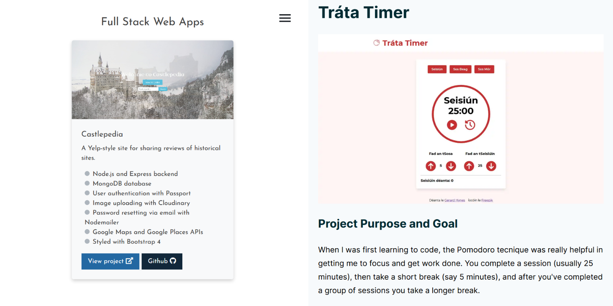

Personal websites are often neglected. In my case, my site hadn't had a redesign in 2 years 😬. Since then I've built dozens of small projects and learned a number of new technologies. But my site didn't reflect any of that.

### The old site and its problems

The old site was a pretty accurate snapshot of my technical abilities at the time. It was a purely static site, with just a little bit of JavaScript for interactions and Sass for styling. I was in the middle of learning CSS Grid and about to start a long period of getting better at JavaScript. I hadn't even touched a frontend framework like React.

The main problem was that the site didn't have a clear message. The old landing page said "I'm a self-taught web developer and programmer". That's fine, but it's pretty generic, and doesn't really tell the visitor what I do or where my interests lie.

The site also failed the "show, don't tell" rule of writing. I did what everyone else seemed to be doing and listed the technologies I had experience with and linked to some projects. But I failed at properly demonstrating those skills or explaining why these projects mattered, how I had built them, or what I had learned.

### Fixing these problems

After thinking about it, I decided that a portfolio site should quickly convey three things:

- Your personality
- Your professional interests
- Your technical skills

In the last year I've fallen down the JavaScript rabbit hole and gotten really interested in the [Jamstack](https://jamstack.org/) as an architecture for building sites and web apps. My new landing page reflects this: "I make fast, modern sites and apps using the Jamstack and fullstack JavaScript".

When I rebuilt the site I intended for it to better demonstrate my current interests and technical skills, so clearly it should have a much greater focus on JavaScript. I settled on a Jamstack site built with:

- [Gatsby](https://www.gatsbyjs.com/)
- [MDX](https://mdxjs.com/)
- [styled-components](https://styled-components.com/).

Gatsby helps make the site fast by default, with built-in code splitting and image optimization. Markdown provides a pretty pleasant writing experience (at least for me), and MDX gives me the option to embed React components if I ever want to include videos, graphs or Codepens. styled-components offer many of the benefits of Sass, such as code organization, nesting and variables, with the added advantage that the CSS is scoped to individual components.

Sure, this might be overkill for a personal website, but I took comfort from Colby Fayock's post, when he says [You're Allowed to Overengineer Your Blog](https://www.colbyfayock.com/2020/07/youre-allowed-to-overengineer-your-blog/), especially in order to solidify the technologies you're learning.

I've also made a concerted effort to update my personal projects from basic detail cards into proper case studies. Here I followed Josh W Comeau's [advice on making a more effective portfolio](https://joshwcomeau.com/effective-portfolio/), by fleshing out the project's goals, tech stack, any pain points encountered, and the lessons learned.

Lastly, in an attempt to write more, I've added this writing section. If you've read Barbara Oakley's [A Mind for Numbers](https://barbaraoakley.com/books/a-mind-for-numbers/) or taken her excellent course on [Learning how to Learn](https://www.coursera.org/learn/learning-how-to-learn), you'll know that trying to explain concepts clearly in writing is a really effective way to check if you actually understand them and also make those concepts stick. Some of these posts might even prove useful for other people.

I've heard that if a podcast can make it past 7 episodes, it'll probably survive. Let's see if I can write more than 7 posts here.
