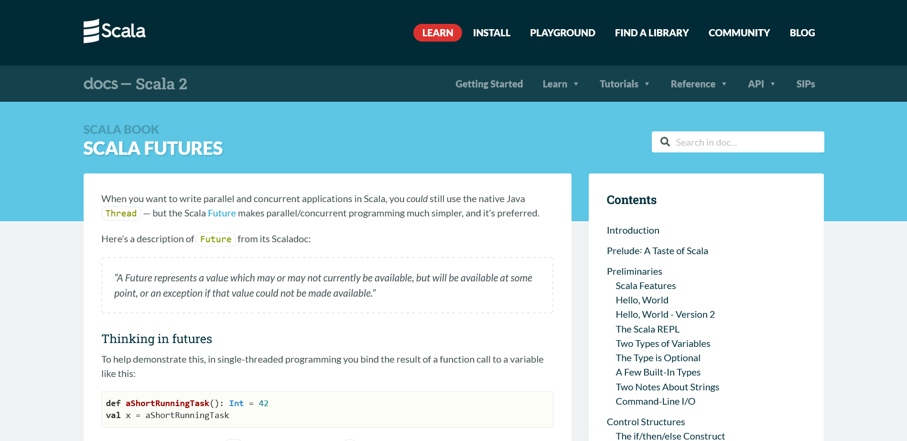
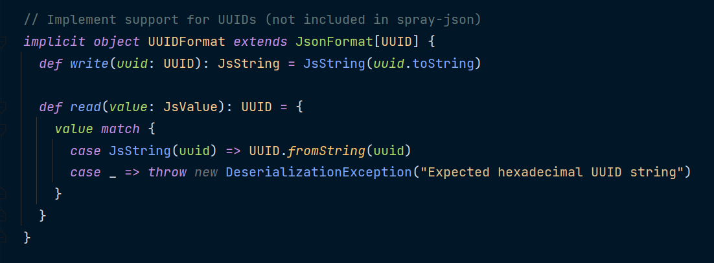
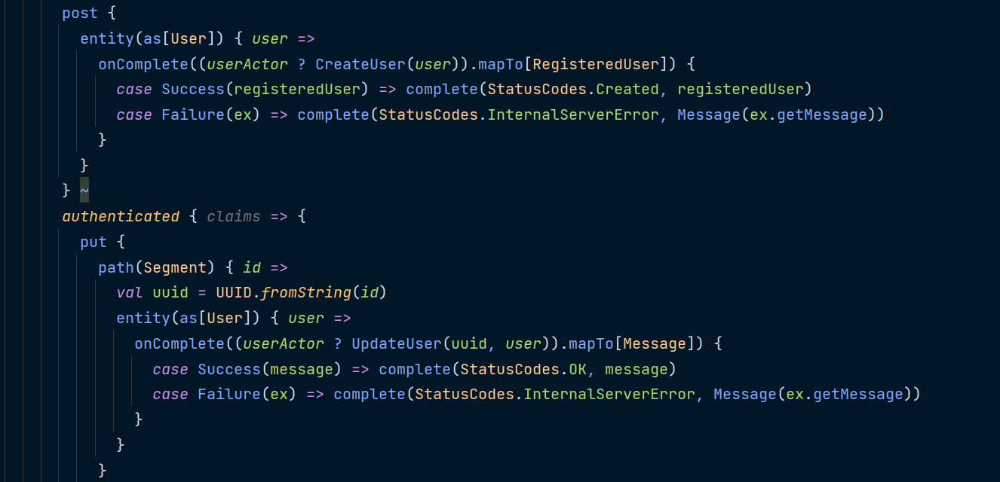
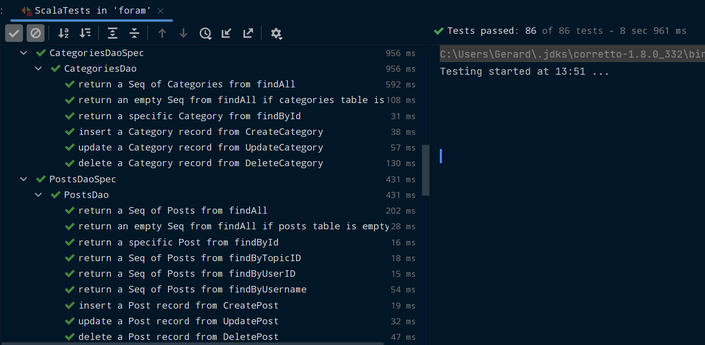

### Project Purpose and Goal

Part of my Higher Diploma (HDip) in Software Design and Development involved building a fullstack app over 12 weeks and writing up detailed design and testing documentation for it. The best part about the project was that the app would be built with input from the company I was going to do my internship with. This ensured that the technologies used and skills learned would be directly relevant to working in industry after I completed my studies.

The company asked me to build a REST API in Scala that persisted data to a PostgreSQL database. I asked to build the frontend in React and use JSON Web Tokens (JWTs) for authentication, and we agreed on this architecture. Before this project, I had built a few fullstack Node.js apps (from tutorials and courses) but had never worked with Scala or connected a React frontend to a custom REST API. Needless to say, I was both excited and nervous to learn a new language and build an ambitious project with it.

I had been using online forums extensively while learning to code and wanted to see if I could build a stripped down version of [Discourse](https://www.discourse.org/), but in React and Scala instead of Ember.js and Ruby on Rails. An app where users would be able to create accounts, read threads and posts, and add their own. Admins would be able to create new subforums and update or delete any content.

The company gave me a lot of freedom about the functionality of the app and made it clear that their priority was that I learned relevant skills and good software development habits.

### Tech Stack

I had initially planned to build the project with Java and the Spring Framework, since the HDip really focused on Java and it's so widely used in industry. But the company recommended that I use Scala since that's the language I'd be working with in my internship. This was a bit stressful as I had to spend the first 3 of my 12 weeks learning the language and its ecosystem as quickly as I could.

I settled on the [Akka](https://akka.io/) toolkit for routing and business logic (in part simply because there were more learning resources for it than for other Scala libraries). Akka's actor system initially required a bit of a mental shift but ultimately helped me to get my head around concurrent programming.

I chose [Slick](https://scala-slick.org/) for interacting with the database, since it let me work with records as if they were Scala collections, benefit from static type checking, and compose functions together.

The company gave me the option of using PostgreSQL or Cassandra for the database. I went with PostgreSQL since I wanted to get more experience working with relational databases, having mostly used MongoDB up to that point.

For the frontend, I chose Next.js and Tailwind CSS as I wanted to maintain my skills with these technologies while I learned Scala. For authentication, I selected JSON Web Tokens as it was a technology I had wanted to learn for some time, and figured that writing authentication "from scratch" would be a valuable learning opportunity.

### Problems and Thought Process

#### 1 - Documentation and Learning Resources for Scala

Finding good resources for Scala was a challenge throughout the project. Compared to JavaScript or Python, Scala is pretty niche. This means there are far fewer resources for learning it, less active forums when asking for help, and fewer questions that have already been asked and answered in GitHub issues or on Stack Overflow.

Also, a lot of Scala documentation just isn't great. Don't get me wrong, the official docs for Scala are excellent. They're detailed, well-written, and accessible. But the docs for many popular Scala libraries are lacking. They use technical terms and don't define them, have broken links, provide examples that use outdated APIs, and don't demonstrate important features, especially when it comes to testing.

Early on, I found as many tutorials and learning resources as I could ([collected here](https://gerardhynes.com/resources-for-learning-scala/)) to quickly get up to speed with Scala and Akka. As the project progressed, I worked my way through the docs, explored Scala projects on GitHub, and started asking questions on the Scala and Lightbend forums.

#### 2 - Marshalling JSON

Working with JSON was a surprising challenge, since it had been pretty straightforward in JavaScript frameworks like Express.js. I used the `spray-json` library to convert, or "marshall", requests and responses into JSON and got used to providing JSON formats for every custom class.

But unfortunately `spray-json` doesn't have built-in support for UUIDs or `OffsetDateTime`. Since I used these in my database schema I had to research and write custom Scala implicits (values that Scala functions will look for if they have not been explicitly passed as a parameter) to tell `spray-json` how to handle them.

Having to think about how to map data to and from other data formats, and how Scala functions can look outside themselves for implicit arguments, gradually gave me an appreciation for Scala as a language, and the programming paradigms it can support.

#### 3 - Asynchronous Programming

Akka is designed for concurrent and asynchronous programming and I made extensive use of Scala Futures (placeholder objects for values that may not yet exist) throughout the project.

For the API routes, I had to learn how to use pattern matching to handle successful and unsuccessful Futures. When testing the database queries, I learned how to chain Futures to ensure they ran in a specific order so they would reset the database and seed sample data before running each test suite.

I already had experience writing asynchronous JavaScript with promises and the async/await syntax and was able to transfer some of this knowledge when working with Scala Futures. Where Scala differed, I studied the documentation and other learning resources to find the idiomatic Scala way to handle these situations.

Working with Scala Futures gave me a greater insight into asynchronous programming, which I have been able to apply when working with asynchronous JavaScript, in the frontend of this app and in other projects.

### Lessons Learned

Before I started the project, I asked the company for advice on good habits to develop and they recommended three things: version control, test-driven development, and agile practices. By the end of the project I had done my best to put each of these into practice and learned a lot in the process.

I was already using Git and GitHub for all my personal projects but I made a conscious effort to adopt better practices, such as using feature branches, committing more often and using more descriptive commit messages.

Agile was something I had practically no experience with at the outset of this project. There are plenty of “A Day in the Life of a Software Developer” videos on YouTube but hardly any of them talk about the process of developing software. Danny Thompson's [What DOES a SOFTWARE DEVELOPER actually do?](https://youtu.be/2M66pchjzDw) is a welcome exception. I tried tracking the steps of this project using Trello but struggled to use it as more than a todo list. Once I started my internship and got to see a team use Agile in action, I learned much more about how Agile works, how teams collaborate, and how projects get managed.

I also had very limited experience with testing before this project and learned a lot, both in terms of writing tests and in refactoring my code to make it more testable. This led me to learn about related topics like dependency injection and mocking. By the end of the project, I had written unit tests for every route and Akka actor, as well as integration tests for all the classes that queried the database.

Writing and debugging tests helped me to reconsider the code I had already written. For example, the tests for the `findLatest` method on the `TopicsDao` class would inconsistently fail. This method should return a list of up to 10 topics ordered by their `created_at` field. Initially the test asserted that a specific sequence of sample topics would be returned from the database. While debugging I uncovered that the problem was caused if two sample topics were created with the exact same datetime, and so the precise order of the sequence could not be guaranteed. The solution was to update the test to check that the `created_at` field on a topic was greater than or equal to the next topic in the sequence (and to anticipate such possibilities in advance in future).

Building the app was both challenging and rewarding, and was a period of concentrated learning. I'm proud that I managed to deliver all the requirements of the project, write detailed documentation, and start to build good software development practices that I trust will serve me well in the future.
